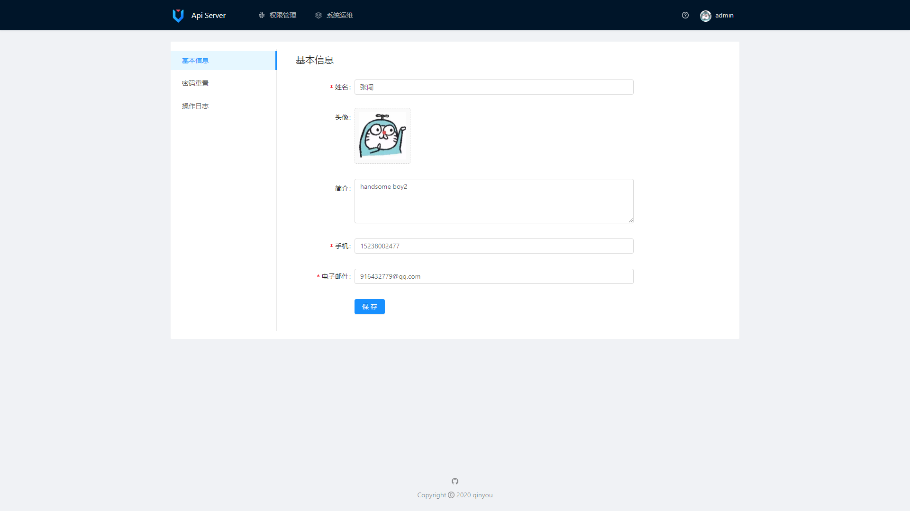
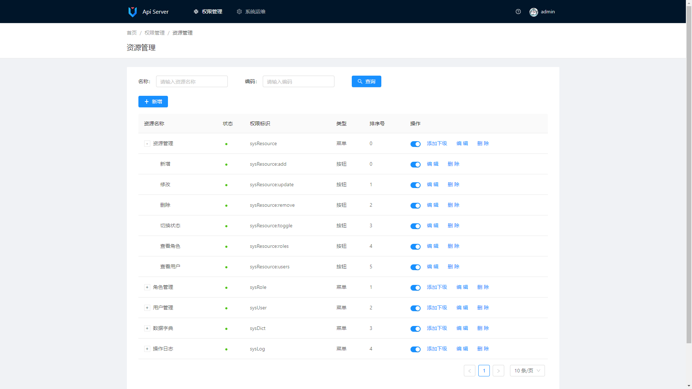
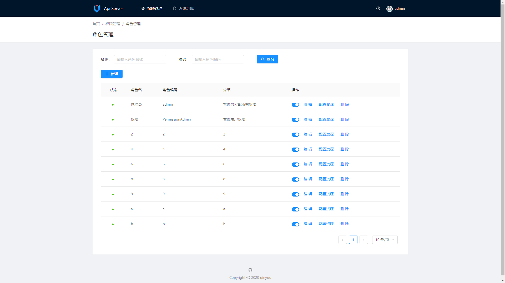
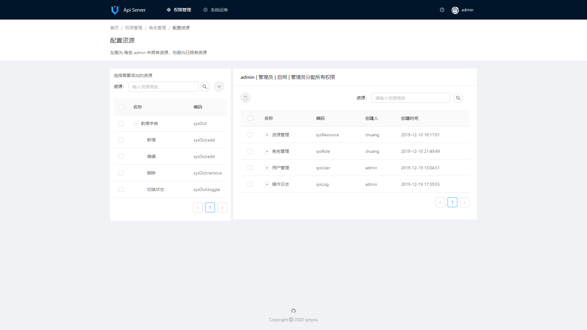
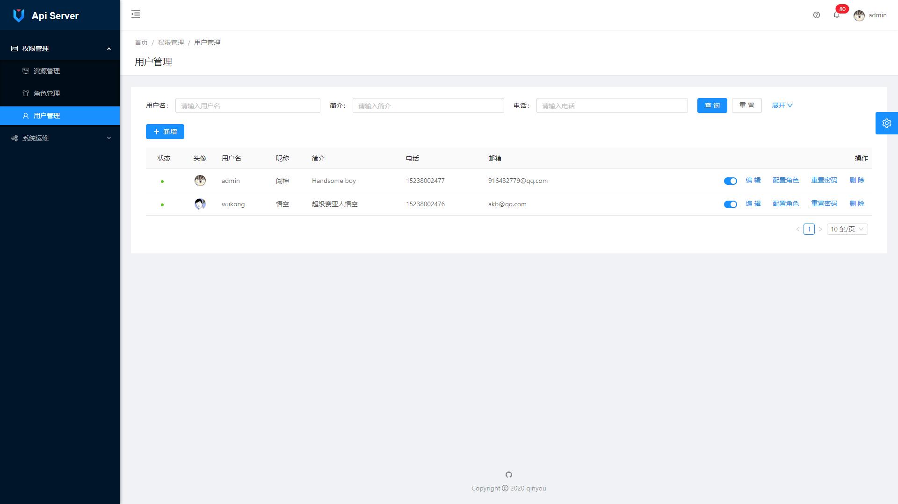
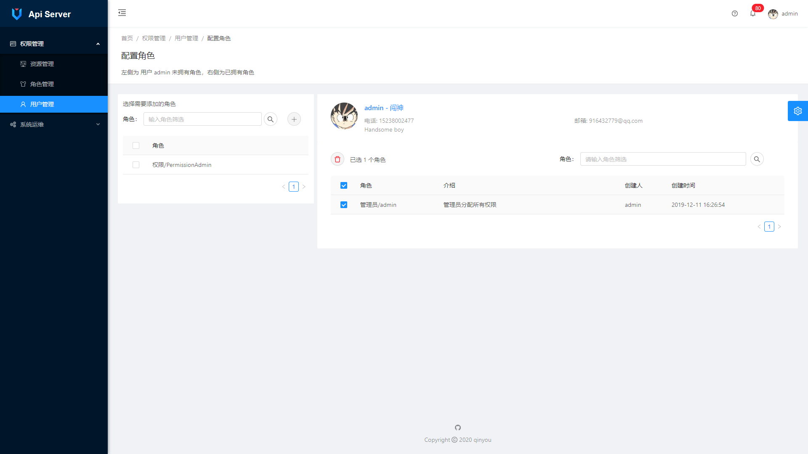

## 简介
 `api-server` 前后分离 权限管理 后台脚手架

## 运行
``` bash
1. IDEA clone 本项目
2. 将api_server.sql 导入 mysql, 配置application-dev.yml 中数据库连接信息
3. 运行 ApiServerApplication
```
预览地址 [http://localhost:8888/v1/index.html](http://localhost:8888/v1/index.html)  
Swagger Api 地址 [http://localhost:8888/v1/swagger-ui.html](http://localhost:8888/v1/swagger-ui.html)

## 截图







## 依赖
```
- spring-boot 2.2.0.RELEASE
- Mybatis-Plus 3.2.0
- spring-security
- java-jwt
- hutool-all 5.0.6
- Ant-Design-Pro-Vue
```

## 前台项目地址（基于 Ant Design Pro Vue)  
[https://github.com/qinyou/api-server-client](https://github.com/qinyou/api-server-client)
