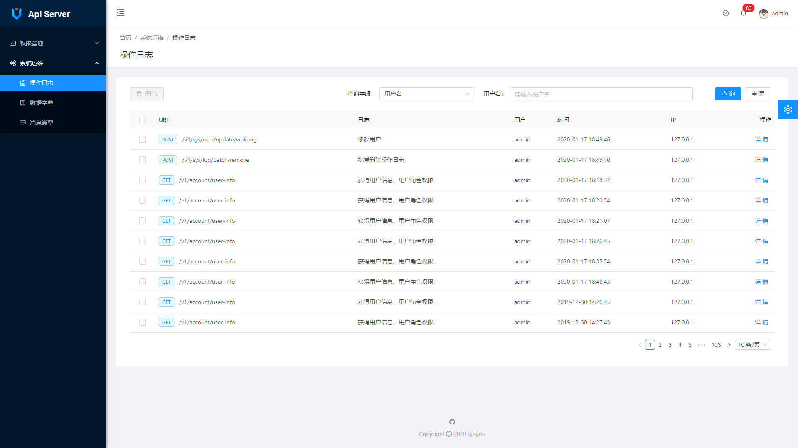

## 简介
 `api-server` 前后端分离 后台脚手架。

## 运行
``` bash
1. IDEA clone 本项目
2. 将api_server.sql 导入 mysql, 配置application-dev.yml 中数据库连接信息
3. 运行 ApiServerApplication
4. swagger api : http://localhost:8888/v1/swagger-ui.html
5. 预览：http://localhost:8888/v1/index.html
```

## 依赖
```
- spring-boot 2.2.0.RELEASE
- Mybatis-Plus 3.2.0
- spring-security
- java-jwt
- hutool-all 5.0.6
```

## 截图





## 前台项目（基于ant-design-pro-vue)  
[https://github.com/qinyou/api-server-client](https://github.com/qinyou/api-server-client)
